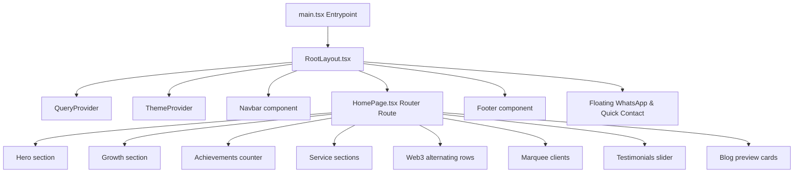

# Technical Implementation Document 🛠️

## 1. System Architecture

The modernized Eon8 website is built as a highly optimized React 19 Single Page Application (SPA) compiled via Vite 8 and typed with TypeScript. It runs on a client-side architecture without any heavy database dependencies.



### 1.1. Core Libraries and Frameworks
- **React 19 & TypeScript**: Component layer and type safety.
- **Vite 8**: Rapid local hot-reloads and optimized tree-shaked production builds.
- **Tailwind CSS v4**: PostCSS compiling, utility-first CSS variables, and modern nested grid utilities.
- **Zustand**: Lightweight global client state to manage the active UI theme (Light/Dark) and lead modal status.
- **GSAP (GreenSock) + ScrollTrigger**: Powering all scroll-driven counter countups, staggered typography entrance animations, and element shifts.
- **Lenis**: Global smooth scroll interpolation.
- **Framer Motion**: Offcanvas navigation, drawer menus, and modal dialog transitions.

---

## 2. Directory Structure & File Mappings

We map the project directory cleanly in our workspace:

```
src/
├── api/
│   └── axios.ts               # Base Axios client (mock forms POST target)
├── assets/
│   ├── eon8_logo_light.png    # Mapped Eon8 light logo
│   └── eon8_logo_dark.png     # Mapped Eon8 dark logo
├── components/
│   ├── ui/
│   │   ├── button.tsx         # Custom interactive button (hover border glow)
│   │   ├── dialog.tsx         # shadcn dialog for Capture Form Modal
│   │   ├── tabs.tsx           # tabs component for sub-sections
│   │   └── accordion.tsx      # FAQ or policy displays
│   ├── Navbar.tsx             # Floating capsule-to-fixed bar layout
│   ├── Footer.tsx             # Multi-column neo-gradient footer
│   ├── LordIcon.tsx           # Animated icons loader
│   ├── LottieAnimation.tsx    # Lottie animation handler
│   ├── ThemeProvider.tsx      # Dark mode class injector
│   └── ThemeToggleButton.tsx  # Interactive rotate sun/moon toggle
├── hooks/
│   └── useUser.ts             # ReactQuery hook for state management
├── layouts/
│   └── RootLayout.tsx         # Handles Lenis initialization, Toast widgets
├── lib/
│   ├── logger.ts              # Custom developer logger
│   └── utils.ts               # cn() class merge utilities
├── pages/
│   ├── HomePage.tsx           # Assembles all frontpage sections
│   ├── AboutPage.tsx          # Agency profile page
│   ├── ContactPage.tsx        # Standard lead contact page
│   └── NotFoundPage.tsx       # Custom 404 page
├── store/
│   ├── useThemeStore.ts       # Global Theme store (Zustand)
│   └── useAppStore.ts         # Modal toggle store (Zustand)
├── types/
│   └── schema.ts              # Form validation structures
├── index.css                  # Tailwinds design system entries
└── main.tsx                   # Bootstraps application
```

---

## 3. Detailed Component Implementations

### 3.1. Navbar (`src/components/Navbar.tsx`)
- Detects page scrolling via a React listener.
- If `window.scrollY > 40`, sets an `isScrolled` boolean state to true.
- Under the hood, Tailwind applies classes dynamically:
  - `isScrolled = false`: `max-w-7xl mx-auto rounded-full mt-6 bg-white/70 dark:bg-slate-900/70 border border-white/20 backdrop-blur-md shadow-lg`
  - `isScrolled = true`: `w-full rounded-none mt-0 bg-white dark:bg-slate-950 border-b border-blue-500/10 shadow-md`

### 3.2. Achievements Counter (`src/pages/HomePage.tsx`)
- Uses GSAP `ScrollTrigger` to hook into viewport intersection.
- Upon entering `top 80%` of screen:
  ```typescript
  gsap.fromTo(counterObj, { val: 0 }, {
    val: targetValue,
    duration: 2,
    ease: "power2.out",
    onUpdate: () => {
      setCount(Math.floor(counterObj.val));
    }
  });
  ```
- Prevents redundant triggers by storing states or utilizing `once: true`.

### 3.3. Math Quiz Captcha (`src/components/ui/dialog.tsx` / `CaptureModal`)
- Generates a random sum equation on form load: e.g., `num1 + num2 = ?` (using values between 1 and 20).
- Stores the sum value in a local state.
- When the user submits, compares the input string to the sum:
  - **Matches**: Form submits successfully and prints data to client logging console.
  - **Fails**: Form triggers shake validation animation and renders an error state.

### 3.4. Global Smooth Scroll (`src/layouts/RootLayout.tsx`)
- Instantiates Lenis in a `useEffect` layout hook:
  ```typescript
  const lenis = new Lenis({
    duration: 1.2,
    easing: (t) => Math.min(1, 1.001 - Math.pow(2, -10 * t)),
    smoothWheel: true,
  });
  function raf(time: number) {
    lenis.raf(time);
    requestAnimationFrame(raf);
  }
  requestAnimationFrame(raf);
  ```
- Integrates with GSAP `ScrollTrigger.update()` so scroll positions stay in sync.

---

## 4. Static Asset Mapping & Migration Strategy

To import the local assets from `www.eon8.com/imgs` into the React application, we copy them directly to Vite's `public/` directory during setup.
- Paths map in components as `/imgs/Logo-White-BG-removebg-preview.png` or `/imgs/digital-globe.png`.
- This ensures that assets are resolved directly by Vite without bundling bottlenecks, maintaining high caching speeds.

---

## 5. Build, Linting & QA Verification
- **Lint Check**: Running `npm run lint` using ESLint v9 config.
- **Build Compiling**: Running `npm run build` compiles TypeScript files using `tsc` and triggers Vite's bundling engine to output pure static assets under the `/dist` directory.
