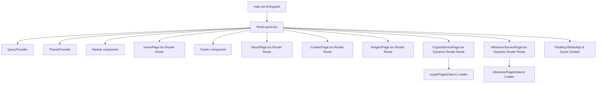

# Technical Implementation Document 🛠️

## 1. System Architecture

The modernized Eon8 website is built as a highly optimized React 19 Single Page Application (SPA) compiled via Vite 8 and typed with TypeScript. It runs on a client-side architecture without any heavy database dependencies.



### 1.1. Core Libraries and Frameworks
- **React 19 & TypeScript**: Component layer and type safety.
- **Vite 8**: Rapid local hot-reloads and optimized tree-shaked production builds.
- **Tailwind CSS v4**: PostCSS compiling, utility-first CSS variables, and modern nested grid utilities.
- **Zustand**: Lightweight global client state to manage the active UI theme (Light/Dark) and lead modal status.
- **GSAP (GreenSock) + ScrollTrigger**: Powering all scroll-driven counter countups, staggered typography entrance animations, and element shifts.
- **Lenis**: Global smooth scroll interpolation.
- **Framer Motion**: Offcanvas navigation, drawer menus, and modal dialog transitions.

---

## 2. Directory Structure & File Mappings

We map the project directory cleanly in our workspace:

```
src/
├── api/
│   └── axios.ts               # Base Axios client (mock forms POST target)
├── assets/
│   ├── eon8_logo_light.png    # Mapped Eon8 light logo
│   └── eon8_logo_dark.png     # Mapped Eon8 dark logo
├── components/
│   ├── ui/
│   │   ├── button.tsx         # Custom interactive button (hover border glow)
│   │   ├── dialog.tsx         # shadcn dialog for Capture Form Modal
│   │   ├── tabs.tsx           # tabs component for sub-sections
│   │   └── accordion.tsx      # FAQ or policy displays
│   ├── Navbar.tsx             # Floating capsule-to-fixed bar layout
│   ├── Footer.tsx             # Multi-column neo-gradient footer
│   ├── LordIcon.tsx           # Animated icons loader
│   ├── LottieAnimation.tsx    # Lottie animation handler
│   ├── ThemeProvider.tsx      # Dark mode class injector
│   └── ThemeToggleButton.tsx  # Interactive rotate sun/moon toggle
├── hooks/
│   └── useUser.ts             # ReactQuery hook for state management
├── layouts/
│   └── RootLayout.tsx         # Handles Lenis initialization, Toast widgets
├── lib/
│   ├── logger.ts              # Custom developer logger
│   └── utils.ts               # cn() class merge utilities
├── pages/
│   ├── crypto/
│   │   ├── cryptoPagesData.ts # Config dataset storing text values for the 13 pages
│   │   └── CryptoServicePage.tsx # Reusable visual template page component
│   ├── influencer/
│   │   ├── influencerPagesData.ts # Config dataset storing text values for the 5 pages
│   │   └── InfluencerServicePage.tsx # Reusable visual template page component
│   ├── HomePage.tsx           # Assembles all frontpage sections
│   ├── AboutPage.tsx          # Agency profile page (with operates accordion)
│   ├── ContactPage.tsx        # Standard lead contact page
│   └── NotFoundPage.tsx       # Custom 404 page
├── store/
│   ├── useThemeStore.ts       # Global Theme store (Zustand)
│   └── useAppStore.ts         # Modal toggle store (Zustand)
├── types/
│   └── schema.ts              # Form validation structures
├── index.css                  # Tailwinds design system entries
└── main.tsx                   # Bootstraps application
```

---

## 3. Detailed Component Implementations

### 3.1. Navbar (`src/components/Navbar.tsx`)
- Detects page scrolling via a React listener.
- Mapped as internal relative SPA router Link paths starting with `/` for the 13 Crypto services, 5 Influencer services, AI Agent services, and About/Contact sections.

### 3.2. Achievements Counter (`src/pages/HomePage.tsx`)
- Uses GSAP `ScrollTrigger` to hook into viewport intersection.
- Upon entering `top 80%` of screen, values count up to targets.

### 3.3. Math Quiz Captcha (`src/components/ui/dialog.tsx` / `CaptureModal`)
- Generates a random sum equation on form load: e.g., `num1 + num2 = ?` (using values between 1 and 20).
- If validation matches, triggers submit callback, else triggers shake animation on inputs.

### 3.4. Global Smooth Scroll (`src/layouts/RootLayout.tsx`)
- Instantiates Lenis in a `useEffect` layout hook and updates GSAP ScrollTrigger updates on scroll.

### 3.5. Dynamic Crypto Services Template (`CryptoServicePage.tsx`)
- Single template architecture feeding directly into dynamic routes. Updates document titles dynamically for SEO and loops through standard Lucide vectors.

### 3.6. Dynamic Influencer Services Template (`InfluencerServicePage.tsx`)
- **Single Template Design**: Routes the 5 sub-service pages into a single layout template.
- **Dynamic SEO Update**: A React hook updates page header meta tags (`title`, `description`) based on the active path parameters.
- **Scroll Trigger Reveals**: Staggers entries of service cards and timeline steps via GSAP ScrollTrigger hook-ins.

---

## 4. Static Asset Mapping & Migration Strategy
- Sourced and moved remote images (e.g. `eon-softtech_2.jpg` and process SVGs) to `/public/imgs/` so all visuals load locally with zero third-party latency.

---

## 5. Build, Linting & QA Verification
- **Build Compiling**: Verified `npm run build` compiles with zero warnings/errors.
